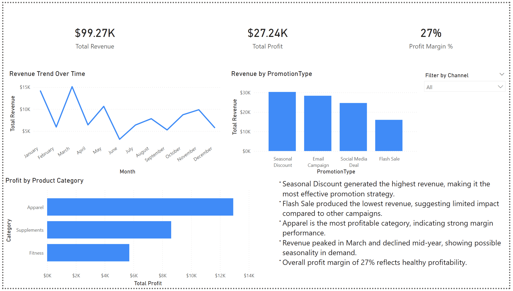
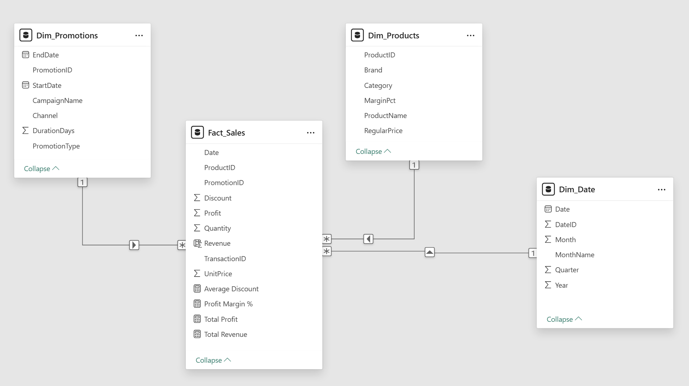

# Retail Promotions Performance Dashboard


**Skills:** Power BI · Power Query · DAX · Star Schema · Promotional Analytics · Profit Margin Analysis · Channel Performance

> Analyzed 2023 retail promotion performance across campaign types, product categories, and sales channels — revealing that deep discounting does not drive more revenue, Social channel is dramatically underperforming, and Supplements represent an untapped high-margin growth opportunity.

---

## Dashboard Preview



---

## Overview

This project analyzes retail promotional performance across four campaign types, three product categories, and three sales channels using 2023 transaction data. The dashboard is designed to support promotional strategy decisions — identifying which campaigns, categories, and channels actually generate revenue and profit, and which are consuming budget without delivering returns.

The analysis goes beyond surface-level revenue reporting to surface margin inefficiencies, channel imbalances, and seasonal gaps that carry direct business implications.

---

## Data Model

A **star schema** was implemented with one fact table and three dimension tables. All data was imported and cleaned via **Power Query** before modeling.

### Schema Diagram



### Tables

| Table | Type | Key Fields |
|---|---|---|
| `Fact_Sales` | Fact | TransactionID, Date, ProductID, PromotionID, Quantity, UnitPrice, Discount, Profit |
| `Dim_Products` | Dimension | ProductID, ProductName, Category, Brand, RegularPrice, MarginPct |
| `Dim_Promotions` | Dimension | PromotionID, PromotionType, Channel, CampaignName, StartDate, EndDate |
| `Dim_Date` | Dimension | DateID, Date, Year, Month, MonthName, Quarter |

### Relationships

```
Fact_Sales[ProductID]    → Dim_Products[ProductID]      (Many-to-1)
Fact_Sales[PromotionID]  → Dim_Promotions[PromotionID]  (Many-to-1)
Fact_Sales[Date]         → Dim_Date[Date]               (Many-to-1)
```

All relationships are configured as **single-direction, one-to-many** to ensure clean filter propagation from dimensions into the fact table.

---

## Key Calculations

### Calculated Column (Fact_Sales)

```dax
Revenue = Fact_Sales[Quantity] * Fact_Sales[UnitPrice] * (1 - Fact_Sales[Discount])
```

This column applies the per-transaction discount before aggregation — the correct approach to avoid overstating revenue in summary measures.

### DAX Measures

```dax
Total Revenue   = SUM(Fact_Sales[Revenue])
Total Profit    = SUM(Fact_Sales[Profit])
Profit Margin % = DIVIDE([Total Profit], [Total Revenue])
Avg Discount    = AVERAGE(Fact_Sales[Discount])
```

---

## Dashboard Features

- **KPI Cards** — Total Revenue ($99.27K), Total Profit ($27.24K), Profit Margin % (27%)
- **Revenue Trend Over Time** — monthly line chart showing seasonality across 2023
- **Revenue by Promotion Type** — bar chart comparing 4 campaign types
- **Profit by Product Category** — horizontal bar chart for Apparel, Supplements, Fitness
- **Channel Slicer** — filter by Online, Email, or Social across all visuals

---

## Key Findings

| Metric | Value |
|---|---|
| Total Revenue | $99,270 |
| Total Profit | $27,240 |
| Profit Margin % | 27% |
| Average Discount | 16% |
| Top Promotion Type | Seasonal Discount ($30,297 — 30.5% of revenue) |
| Weakest Channel | Social (4.4% of revenue — 10x below Online and Email) |

---

## Key Insights

**1. Deep discounting does not drive more revenue — it just costs more margin.**
Seasonal Discount generated the highest revenue ($30,297) with only a 16% average discount. Flash Sale offered the steepest discounts (29.6%) but produced the least revenue ($15,990). Email Campaign delivered $28,350 with just 7.6% discount. Discount depth is not correlated with revenue performance — Seasonal and Email campaigns should receive more investment; the Flash Sale strategy needs to be reconsidered.

**2. Supplements are the highest-margin category but the most underexploited.**
Supplements carry a 35% profit margin — well above Apparel (28%) and Fitness (20%) — yet contribute the least revenue ($24,605 vs. Apparel's $46,139). A targeted campaign to grow Supplements volume, even at a moderate discount, could significantly improve overall profit without sacrificing margin efficiency.

**3. Social channel is contributing almost nothing — 4.4% of total revenue.**
Online (48.3%) and Email (47.3%) together account for 95.6% of revenue. Social delivers just $4,389 — roughly 10x less than either other channel. This is either a resource allocation problem, a targeting problem, or both. Social budget should be audited before further investment, or redirected to Email and Online where ROI is proven.

**4. Revenue collapses mid-year — June hits 79% below the March peak.**
January ($14,143) and March ($15,111) are the strongest months. Revenue then drops sharply through summer — June records just $3,144. A partial recovery follows in Q4 with November at $9,863. The April–September window represents a critical promotional gap that current campaign timing is not addressing.

**5. The 27% blended margin masks a Fitness category problem.**
The portfolio-level margin looks healthy but Fitness operates at only 20% — significantly below average — while receiving the same promotional investment as higher-margin categories. Applying equal budgets across unequal-margin categories is an inefficient strategy. Fitness either needs margin improvement through pricing or supplier negotiation, or deprioritization in promotional planning.

---

## What I'd Build With Real Data

With a production dataset, the model would be extended to include:

- **Promotion ROI calculation** — cost of promotion vs. incremental revenue generated
- **Basket analysis** — which products are frequently purchased together during promotions
- **Channel attribution** — multi-touch attribution to understand how channels interact
- **Time intelligence** — YTD, MoM%, and rolling averages using `DATEYTD()` and `DATEADD()`
- **Statistical significance testing** — to confirm whether campaign differences are real or noise

---

## Tools Used

| Tool | Usage |
|---|---|
| Power BI Desktop | Data modeling, DAX, interactive dashboard design |
| Power Query | Data import, cleaning, and transformation |
| DAX | Calculated column and measures |
| Excel | Source dataset (RetailPromotions2023.xlsx) |
| Star Schema | Data modeling architecture |

---

## Key Learning

This project demonstrated that **promotional effectiveness is not determined by discount depth** — it is determined by campaign design, channel fit, and audience alignment. A dashboard that only reports revenue totals would miss this entirely. The value of the analysis is in the margin and channel breakdown, not the top-line number.

---

## File Structure

```
├── retail-promotions-dashboard.pbix   # Power BI report
├── RetailPromotions2023.xlsx          # Source data
├── dashboard-overview.png             # Dashboard screenshot
├── data-model-star-schema.png         # Data model schema
└── README.md
